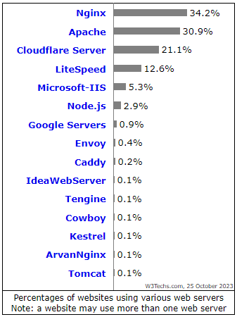
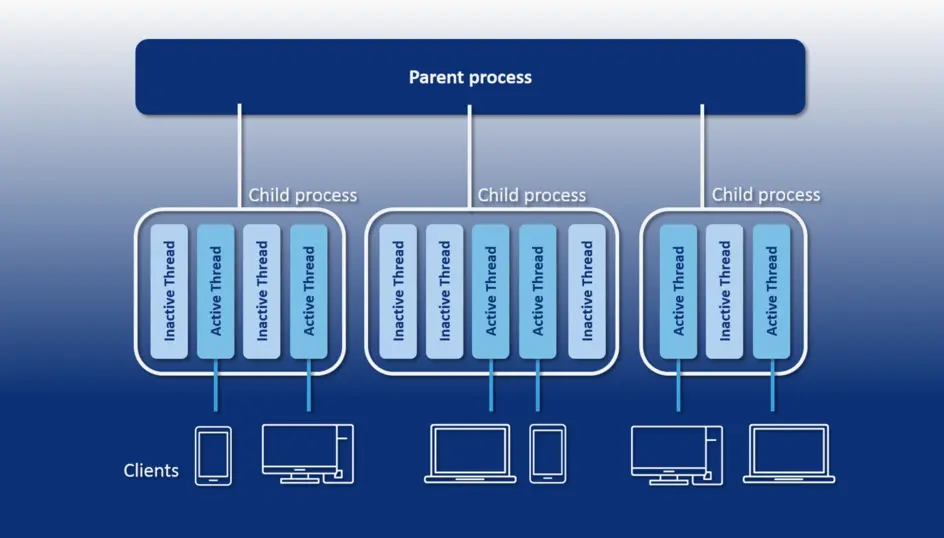
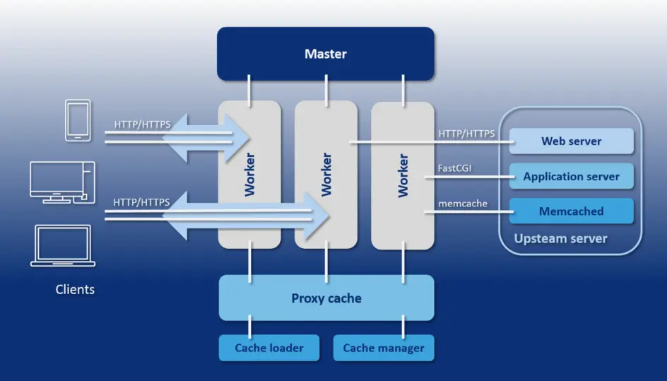
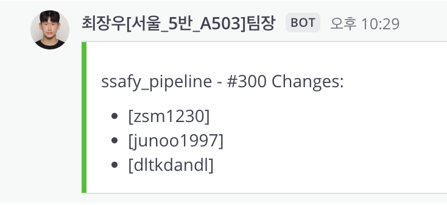

## 개요
Pinokio 서비스를 구현하기 위해 본인 파트(DevOps)에 대한 회고를 담은 리드미입니다. 
기존 팀에 결원이 발생하여 해체되고 기획, 설계가 끝난 3주차에 Pinokio팀에 합류하게 되었고 남은 개발기간은 대략 3주동안 개발을 진행했습니다.

## 문제 정의
개발을 진행 중이던 팀에 합류하는 것은 처음이라서 먼저 팀에 적응하고자 하였습니다.
팀에 적응하며 요구사항 명세서, ERD, 와이어프레임 등을 확인하며 우리 팀은 어떤 서비스를 구현하고자 하는 구나 파악하였습니다.
파악하던 중 간트차트, 스크럼 내용에는 배포, 지급받은 AWS 구축에 대한 얘기가 없어 팀원들과 이 사항에 대해서 논의하였습니다.

당시, 팀원들 모두 배포와 AWS의 OS(Ubuntu), Linux에 대한 경험이 없어 일단 로컬 단계에서 개발을 진행하고 마지막 주에 배포를 전부 진행하는 방식으로 개발을 진행하고 있었습니다.
요구사항과 API 개발 명세서의 내용의 양이 생각보다 많아, 팀원들과 배포를 진행하면서 생기는 에러를 빠르게 잡아야 할 것 같다고 제안하였습니다. 팀원들은 오히려 좋다고 반겨주었고 팀에 적응함과 동시에 Pinokio 팀의 배포와 CI/CD 파이프라인을 구축하는 것으로 결정하였습니다.

남은 기간(3주) 동안 해야만 하는 것들에 대해 요구사항으로 정리해봤습니다.

1. 진행 중인 로컬 개발환경을 지급받은 AWS EC2(t2.xLarge) 인스턴스로 빠른 시일내에 init한 프로젝트를 컨테이너화.
2. 로컬 개발환경을 클라우드 환경으로 옮기며 필요한 기본적인 설정(포트포워딩, SSL 설정) 등을 빠른 시일내에 마무리 할 것.
3. 개발 양이 많아 로컬 환경에서 변경사항이 생겼을 때 클라우드로 올리며 생기는 트러블들을 빠른 시일 내에 잡을 수 있도록 클라우드 환경에 변경사항을 반영할 것.

위와 같은 세 가지의 요구사항을 설정하여 팀원들에게 공유한 후, 프로젝트를 진행하였습니다.

## AWS 구축
가장 첫번째로 진행해야하는 부분은 SSL 설정이었습니다. 

### SSL 
SSL(Secure Sockets Layer)은 웹 서버와 사용자의 브라우저 사이에서 데이터를 안전하게 주고받기 위한 보안 프로토콜입니다. 흔히 http**s**: // 의 S는 Secure이 적용된 연결이라고 할 수 있습니다. 현재 TLS(Transport Layer Security)와 같은 의미입니다.

#### SSL의 역할
SSL은 다음과 같은 세 가지 역할을 가집니다.
1. 데이터 암호화
2. 인증
3. 데이터 무결성

따라서, EC2에 배포하는 모든 것들은 보안이 지켜져야만 하는 소중한 정보들을 내포 (ex, 고객들의 개인정보)하고 있기 때문에 SSL, TLS는 필수적으로 설정해야 합니다.

SSL을 발급받을 때 가장 많이 쓰이는 Certbot을 통하여 SSL 인증서를 발급 받았습니다.

```
sudo apt install certbot python3-certbot-nginx
```
```
sudo certbot --nginx -d example.com -d www.example.com
```

일반적으로 Let's Encrypt에서 Certbot으로 발급받으면 두 가지의 pem키가 생성됩니다. 향후 Nginx의 SSL 설정에서 이 pem키를 넣어주면 됩니다.
- fullchain.pem
- privkey.pem

### **NginX**, ~~Apache Webserver~~
Pinokio에서는 당시 세 팀으로 나누어져 개발을 진행하고 있었습니다.
1. AI
2. BackEnd
3. FrontEnd
AI는 노인 분류를 위한 FaceNet 모델을 serving 하기위한 fastAPI 서버이고
Backend는 기본적인 비즈니스 로직과 인증서버의 역할을 하는 Main Spring 서버
FrontEnd는 키오스크의 정적 페이지, 아두이노 거리인식을 위한 SSE 요청 등 React Native로 이루어져 있습니다. 

따라서 클라이언트에서 보내는 요청을 알맞게 AWS 앞단에서 프록시하는 과정이 필수적입니다. 
이 과정에서 사용되는 웹서버는 Nginx, Apache Webserver가 있습니다. 



23년 10월 기준으로 nginx는 34%의 점유율을 가져가는 메인스트림의 웹서버입니다. 하지만 단순히 점유율이 높다고해서 프로젝트에 적용하기보다는 정보를 검색한 후 적용해보고자 했습니다.

아래는 Apache Web server의 아키텍처 입니다.
사진과 같이 Apache는 멀티 프로세스 + 멀티 프로세스 구조로 Parent 프로세스 아래에 Child 프로세스들이 있으며 각각 여러 스레드를 보유하고 있습니다.
<br></br>


아래는 Nginx의 아키텍처 입니다.
사진과 같이 Nginx 는 Master-worker 구조로 마스터 프로세스 아래 여러 워커 프로세스들이 동작하고 프록시 캐싱 등을 수행하고 있습니다.
<br></br>


노인 전용 키오스크 Pinokio는 짧은 시간 내에 여러 요청들이 오는 특징을 가지고 있습니다. 
따라서 요청 처리 시 각 연결마다 별도의 프로세스, 별도의 스레드를 생성하는 Apache를 선택하는 경우, 리소스의 최적화가 어렵다고 판단하였습니다.

**반면 NginX는 이벤트 기반의 비동기 I/O 모델을 사용하므로 하나의 Worker 프로세스가 다수의 연결을 효율적으로 관리할 수 있어 Pinokio에 적정하다고 판단하였습니다.**

작성한 nginx.conf에 대해 요약하면
1. HTTP Request Redirection 
모든 HTTP 요청은 NginX 앞단 블록에서 HTTPS로 리디렉션하며 443포트로 적용한 SSL 인증서를 활용해 보안 연결을 제공합니다.
2. 기본 웹 컨텐츠 제공
HTTPS는 /usr/share/nginx/html 디렉토리의 정적 파일을 제공하고 SPA 특성을 고려해 존재하지 않는 경로는 index.html로 처리합니다.
3. Reverse Proxy
    - /api/ 경로의 요청은 pinokio의 Spring 서버로 
    - /fast/ 경로의 요청은 pinokio의 fastAPI서버로 프록시 되며
    - 각각의 웹소켓 연결과 CORS 처리를 지원하게끔 작성하였습니다.
4. 에러 페이지 처리 
    500 502 503 504 등 서버 에러 발생시 /50x.html을 return 시킵니다.

#### CORS 처리 
CORS(교차 출처 리소스 공유)에러는 다른 출처에서 요청을 보낼 때 발생하는 에러입니다. 프로젝트를 진행할 때 이 에러로 많은 고생을 했어서 nginx에서 CORS를 어떻게 방지했는 지 요약해보겠습니다.
```
Access-Control-Allow-Origin '*'
Access-Control-Allow-Methods 'GET, POST, OPTIONS'
Access-Control-Allow-Headers
Access-Control-Max-Age 1728000
Content-Type 'text/plain charset=UTF-8' & Content-Length 0
return 204
```
- 모든 도메인에서 오는 요청을 허용하고, GET, POST, 프리플라이트 요청에 사용되는 OPTIONS 메서드를 허용합니다.
- 클라이언트가 요청 시 사용할 수 있는 특정 헤더를 허용하고 프리플라이트 응답을 약 20일 동안 캐시할 수 있게 하여 성능을 개선하였습니다.


<details> <summary>작성한 nginx.conf입니다.</summary>

```
server {
    listen       80;
    listen  [::]:80;
    server_name  domain_IP;
    
# Redirect HTTP to HTTPS
    location / {
        return 301 https://$host$request_uri;
    }
}

server{
    listen 443 ssl http2;
    server_name domain_IP;

    # SSL certificates
    ssl_certificate /etc/letsencrypt/live/domain_IP/fullchain.pem;
    ssl_certificate_key /etc/letsencrypt/live/domain_IP/privkey.pem;

    ssl_protocols TLSv1.2 TLSv1.3;
    ssl_prefer_server_ciphers on;
    ssl_ciphers HIGH:!aNULL:!MD5;


    location / {
        root   /usr/share/nginx/html;
        index  index.html index.htm;

        proxy_set_header Host $host;
        proxy_set_header X-Real-IP $remote_addr;
        proxy_set_header X-Forwarded-For $proxy_add_x_forwarded_for;
        proxy_set_header X-Forwarded-Proto $scheme;
        
        # SPA 새로고침 처리
        try_files $uri $uri/ /index.html =404;
    }

    location /api/ {
        proxy_pass http://pinokkio-backend:8080;
        proxy_set_header Host $host;
        proxy_set_header X-Real-IP $remote_addr;
        proxy_set_header X-Forwarded-For $proxy_add_x_forwarded_for;
        proxy_set_header X-Forwarded-Proto $scheme;

        # CORS 설정
        #add_header 'Access-Control-Allow-Origin' '*';
        #add_header 'Access-Control-Allow-Methods' 'GET, POST, OPTIONS';
        #add_header 'Access-Control-Allow-Headers' 'Origin, Authorization, Accept, Content-Type, X-Requested-With';
        
        proxy_http_version 1.1;
		    proxy_set_header Upgrade $http_upgrade;
		    proxy_set_header Connection "upgrade";
        }
    }

    location /fast/ {
        proxy_pass http://fast-pinokkio-backend:5000/; 
        proxy_set_header Host $host;
        proxy_set_header X-Real-IP $remote_addr;
        proxy_set_header X-Forwarded-For $proxy_add_x_forwarded_for;
        proxy_set_header X-Forwarded-Proto $scheme;

        add_header 'Access-Control-Allow-Origin' '*';
        add_header 'Access-Control-Allow-Methods' 'GET, POST, OPTIONS';
        add_header 'Access-Control-Allow-Headers' 'Origin, Authorization, Accept, Content-Type, X-Requested-With';

        proxy_http_version 1.1;
        proxy_set_header Upgrade $http_upgrade;
        proxy_set_header Connection "upgrade";

        if ($request_method = 'OPTIONS') {
            add_header 'Access-Control-Allow-Origin' '*';
            add_header 'Access-Control-Allow-Methods' 'GET, POST, OPTIONS';
            add_header 'Access-Control-Allow-Headers' 'Origin, Authorization, Accept, Content-Type, X-Requested-With';
            add_header 'Access-Control-Max-Age' 1728000;
            add_header 'Content-Type' 'text/plain charset=UTF-8';
            add_header 'Content-Length' 0;
            return 204;
        }
    }

    error_page   500 502 503 504  /50x.html;
    location = /50x.html {
        root   /usr/share/nginx/html;
    }
}
```
</details>


## Docker 와 Docker Compose
위에서 설명한 바와 같이 AI, BE, FE의 파트들의 각각 로컬에 반영한 부분들을 컨테이너화 하여 EC2에 적용했어야 했습니다. 
컨테이너 하는 과정에서 다른 방법이 떠오르지 않아 Dockerfile을 작성하여 컨테이너화 시켰습니다.

React native의 Dockerfile입니다.
```
#빌드 스테이지
FROM node:18 AS build
WORKDIR /app
COPY ./package.json ./package-lock.json /app/
RUN npm install
COPY . /app
RUN ls -a
RUN npm run build 

# 배포 스테이지
FROM nginx:1.21.4-alpine
COPY nginx.conf /etc/nginx/conf.d/default.conf

COPY --from=build /app/build /usr/share/nginx/html
EXPOSE 80
CMD [ "nginx", "-g", "daemon off;" ]
```

- node js 18 version을 베이스 이미지로 사용하고 
- 각각의 작업, 의존성 디렉토리를 복사, 의존성 파일을 기반으로 
- 프로젝트에 필요한 패키지를 설치하여 /app에 복사합니다.
- 복사한 파일들을 빌드하여 배포용 파일을 /app/build에 저장하게 됩니다.

다음 배포 스테이지에서는 빌드된 정적 파일들을 nginx 서버를 통해 정적파일을 하게 하는 부분입니다.

- nginx alpine version을 베이스 이미지로 사용하고
- nginx.conf을 컨테이너 내의 nginx 설정 디렉토리로 복사하여 설정합니다.
- 빌드된 정적파일을 /usr/shar/ngixn/html로 복사합니다.

FastAPI의 Dockerfile입니다.
```
FROM python:3.12
RUN apt-get update && apt-get install -y \
    libgl1-mesa-glx \
    libglib2.0-0
WORKDIR /app
COPY requirements.txt /app/requirements.txt
RUN pip install --no-cache-dir -r requirements.txt
COPY . /app

CMD ["uvicorn", "face_analysis_api:app", "--host", "0.0.0.0", "--port", "5000"]
```

- python:3.12 version을 베이스 이미지로 사용하고
- 의존성에 에러가 생겼던 부분들을 직접 설치해줍니다.(libgl1-mesa-glx와 libglib2.0-0)
- /app 을 작업 디렉토리로 설정하고 
- 로컬의 requirements.txt를 /app으로 복사
- pip install --no-cache-dir -r requirements.txt 복사한 의존성을 설치해줍니다.
- uvicorn 실행 

여기서 face_analysis_api:app은 face_analysis_api.py 파일 내의 FastAPI 애플리케이션 인스턴스(app)를 의미하고 호스트는 모든 IP에서 접근 가능하도록 0.0.0.0, 포트는 5000으로 설정하였습니다.

```
FROM gradle:8.8-jdk21 AS builder
WORKDIR /app
COPY gradle/ gradle/
COPY build.gradle settings.gradle gradlew ./
RUN chmod +x gradlew
COPY src/ src/
ENV GRADLE_USER_HOME /app/.gradle
RUN ./gradlew build -x test --no-daemon --stacktrace
RUN ls -l /app/build/libs/
FROM openjdk:21-jdk-slim
WORKDIR /app
COPY --from=builder /app/build/libs/pinokkio-0.0.1-SNAPSHOT.jar /app/app.jar
EXPOSE 8080

ENTRYPOINT ["java", "-jar", "/app/app.jar"]
```
- 빌드 환경으로 gradle:8.8-jdk21의 베이스 이미지로 사용하고
- Gradle 구성 파일과 래퍼를 복사 후 권한을 부여합니다.
- Gradle 캐시 디렉토리를 /app/.gradle로 명시하여 테스트를 건너 뛰고 Gradle 빌드를 실행합니다.
- 빌드된 내용 중 컴파일 된 JAR 파일만 복사하여 
- JAR를 실행시키는 진입점을 설정합니다.

현재 세 개의 컨테이너를 생성하였고 이 컨테이너를 각각 관리할 수 없으므로 docker-compose.yml에 명시하여 한꺼번에 관리하게끔 구현하였습니다.

<details><summary>docker-compose.yml</summary>

```
version: '3'

services:
  backend:
    container_name: pinokkio-backend
    build:
      context: ./backend/pinokkio
      dockerfile: Dockerfile
    ports:
      - "8080:8080"
      - "3333:3333"
      - "3334:3334"
        
    environment:
      - SPRING_DATASOURCE_URL=jdbc:mysql://mysql:3306/pinokkio?serverTimezone=Asia/Seoul
      - SPRING_DATASOURCE_USERNAME=root
      - SPRING_DATASOURCE_PASSWORD=ssafy
      - SPRING_JPA_HIBERNATE_DDL_AUTO=create
      - SPRING_REDIS_HOST=redis
      - SPRING_REDIS_PORT=6379
      - SPRING_MAIL_USERNAME=${EMAIL}
      - SPRING_MAIL_PASSWORD=${EMAIL_PW}
      - JWT_SECRET=${JWT_SECRET}
      - BUCKET=${BUCKET}
      - S3_ACCESS_KEY=${S3_ACCESS_KEY}
      - S3_SECRET_KEY=${S3_SECRET_KEY}
      - REGION=${REGION}
      - LIVEKIT_API_KEY=${LIVEKIT_API_KEY}
      - LIVEKIT_API_SECRET=${LIVEKIT_API_SECRET}
      - ENCRYPTION_KEY=${ENCRYPTION_KEY}
    depends_on:
      - mysql
      - redis

  fast_pinokkio:
    container_name: fast-pinokkio-backend
    build:
      context: ./backend/fast_pinokkio
      dockerfile: Dockerfile
    ports:
      - "5000:5000"
    environment:
      - REDIS_HOST=redis
      - REDIS_PORT=6379
    depends_on:
      - redis

  frontend:
    build:
      context: ./frontend
      dockerfile: Dockerfile
    ports:
      - "80:80"
      - "443:443"
    volumes:
      - /etc/letsencrypt:/etc/letsencrypt:ro
    depends_on:
      - backend

  mysql:
    image: mysql:8.0
    environment:
      MYSQL_ROOT_PASSWORD: ssafy
      MYSQL_DATABASE: pinokkio
    ports:
      - "3306:3306"
    volumes:
      - mysql-data:/var/lib/mysql

  redis:
    image: redis:latest
    ports:
      - "6379:6379"

volumes:
  mysql-data:
```
</details>

- Spring 컨테이너의 컨테이너 이름, 빌드 경로, 포트 매핑, 환경변수를 주입해주고 mysql, redis의 의존성을 부여하여 두 개의 컨테이너가 준비되어야 실행하게끔 구현하였습니다.
- FastAPI 컨테이너 역시 컨테이너 이름, 빌드 경로, 포트 매핑, 환경 변수를 주입해주고 db, redis에 의존성을 부여하여 구현하였습니다.
- frontend 컨테이너는 빌드경로, 포트매핑을 해주고 nginx.conf에 정적 파일을 저장이 되어있어 SSL 인증서를 Volume 시키고 백엔드가 실행되어야 실행되는 의존성만 추가하였습니다.
- MySQL 컨테이너의 base image는 mysql:8.0, 환경변수를 설정해주고 포트를 매핑하여 구현했습니다.
#### mysql volume
Docker 에서는 데이터를 지속적으로 저장하고 관리할 수 있게 Docker volume을 사용할 수 있게 하였습니다. 컨테이너의 생명주기와는 별개로 호스트 머신에 데이터를 보관하여 컨테이너를 삭제하거나 재시작 되더라도 데이터는 유지됩니다. 

#### 지나고보니 
구현 당시엔 무조건 되야만 하니 되게 하는 모든 방법으로만 구현하여 회고 과정에서 보안적으로 상당히 위험한 부분을 발견하였습니다.
1. 환경변수가 일부 노출되어 접근 권한이 없는 사용자에게 노출이 된다면 보안 위험이 발생할 수 있었습니다.
2. MySQL 루트 비밀번호를 직접적으로 평문으로 명시하였습니다.
정말 기초적인 부분을 놓치고 갔던 것 같습니다.
3. Docker Secret을 사용하거나 .env에 빠짐없이 넣었어야하는 제 실수였습니다.


## Jenkins CI/CD
로컬에서 커밋되는 모든 부분들을 반영해야했고 즉각적인 빌드를 통하여 빌드여부를 확인해야했기 때문에 Jenkins를 사용하였습니다.
GitLab에서 진행되는 프로젝트이다 보니 Github Actions보다는 훨씬 레퍼런스가 많을 것이라고 판단하여 사용하게 되었습니다.

### Freestyle, ~~Pipeline Project~~
Jenkins로 CI/CD를 구축하는 방법은 다음 두 가지입니다.
- Freestyle
- Pipeline Project

두 가지 방식을 비교한 도표입니다.

| 비교 항목          | Freestyle 프로젝트       | Pipeline 프로젝트               |
|--------------------|------------------------|--------------------------------|
| **설정 방식**     | UI 기반 (GUI)           | 코드 기반 (Jenkinsfile, Groovy) |
| **사용 난이도**   | 쉬움                    | 어려움 (스크립트 작성 필요)     |
| **유지보수**      | 변경 사항 추적 어려움    | 코드로 관리 가능 (Git 연동)      |
| **CI/CD 과정 복잡도** | 단순한 빌드 및 배포에 적합 | 복잡한 빌드, 테스트, 배포 가능  |
| **병렬 실행**     | 불가능                   | 가능                            |
| **유연성**       | 제한적                   | 높은 유연성                      |
| **플러그인 지원** | 플러그인 필요            | Groovy 스크립트로 커스터마이징 가능 |

당시 저는 Groovy 코드에 대한 지식이 없고 관리해야할 컨테이너의 수가 적어서 단순한 빌드 및 배포 과정이라고 판단하였습니다. 
따라서 Freestyle 방식의 쉘 스크립트로 CI/CD를 구축하였습니다.

```bash
#!/bin/bash

sudo docker-compose down

cd /home/ubuntu/S11P12A601
if [ -f .env ]; then
    export $(cat .env | xargs)
fi
sudo docker-compose up --build -d
```

#### 지나고보니 
빠르게 개발했어야 했기 때문에 일단은 진행하였지만 아쉬운 부분이었습니다. job을 통해 효과적으로 관리할수 있었다면 조금 더 jenkins를 이해하고 사용한 것이라고 생각합니다
그래서 다시 pipeline 방식으로 이를 작성해보았습니다.

<details><summary>Pipeline 방식</summary>

```
pipeline {
    agent any

    environment {
        ENV_FILE = "/home/ubuntu/S11P12A601/.env"
    }

    stages {
        stage('Checkout') {
            steps {
                git branch: 'develop', credentialsId: 'gitlab-credentials', url: 'https://lab.ssafy.com/s11-webmobile1-sub2/S11P12A601.git'
            }
        }

        stage('Stop and Remove Existing Containers') {
            steps {
                sh 'sudo docker-compose down'
            }
        }

        stage('Load Environment Variables') {
            steps {
                script {
                    if (fileExists(env.ENV_FILE)) {
                        sh "export $(cat ${env.ENV_FILE} | xargs)"
                    }
                }
            }
        }

        stage('Build and Deploy') {
            steps {
                sh 'sudo docker-compose up --build -d'
            }
        }
    }
}

```
</details>

### Webhook
Webhook이란 특정 이벤트가 발생했을 때 일종의 트리거(콜백) 역할로 사용하여 자동화된 알림 시스템을 구현할 때 많이 쓰이는 방법입니다. 
Jenkins에서 당시 우리 팀이 사용하고 있었던 메신저(Mattermost) webhook을 통하여 빌드의 성공/실패 상태를 알 수 있도록 자동화하였습니다.



## 결론
### 개인적 측면
- 기획과 설계가 끝난 후에 팀에 합류하여 빠르게 적응하고 빠르게 개발해야해서 팀원들의 보조가 없었다면 힘들었을 것 같은 프로젝트였습니다. 
- 하지만 개발자는 혼자서 하는 직업이 아니라 팀 단위의 프로세스를 수행하는 집단이라고 생각하기 때문에 팀을 위한 개발을 해야한다고 더욱 더 다짐하는 계기가 되었습니다. 
- 팀에 상황에 맞는 개인의 요구사항을 머리속으로 그려낼 수 있어야 했고 앞으로도 팀에 소속할 때 이 경험을 토대로 주도적인 '나의 일'을 할 수 있는 개발자가 되어야겠다고 회고를 마칩니다.
- 베스트 멤버 수상 :)
### 팀적 측면
- 대략 200개의 넘는 반영사항을 자동화 하여 개발 생산성이 극대화 될 수 있었습니다.
- 안정적으로 AWS가 구축되어 개발하는 과정에서의 트러블 슈팅을 최소화 할 수 있었습니다. 

### References

https://nginxstore.com/blog/nginx/%EC%A0%84%EC%84%B8%EA%B3%84-%EC%9B%B9-%EC%84%9C%EB%B2%84-%EB%A6%AC%EB%B2%84%EC%8A%A4-%ED%94%84%EB%A1%9D%EC%8B%9C-%EC%A0%90%EC%9C%A0%EC%9C%A8-1%EC%9C%84-nginx/
https://www.interviewbit.com/blog/nginx-vs-apache/
https://www.ionos.com/digitalguide/server/know-how/nginx-vs-apache-a-web-server-comparison/